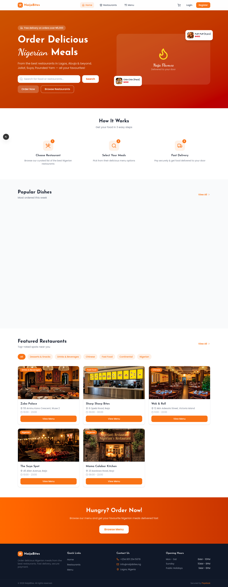
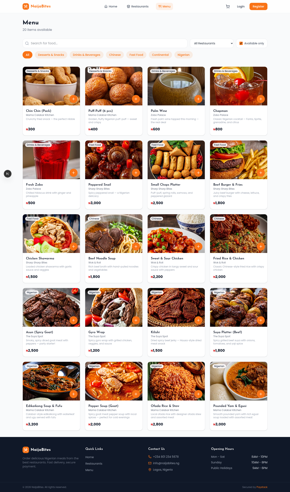
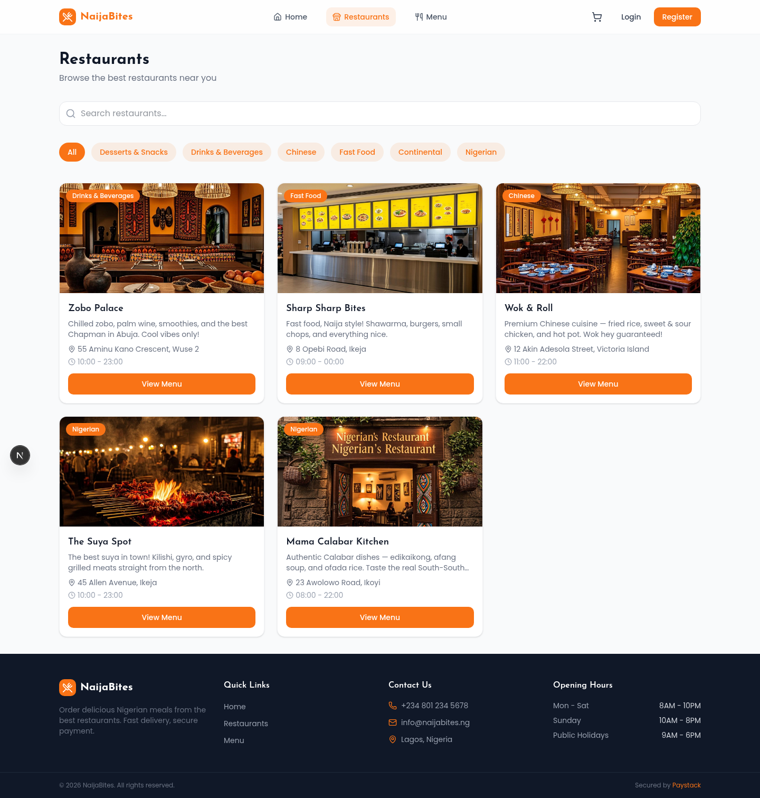
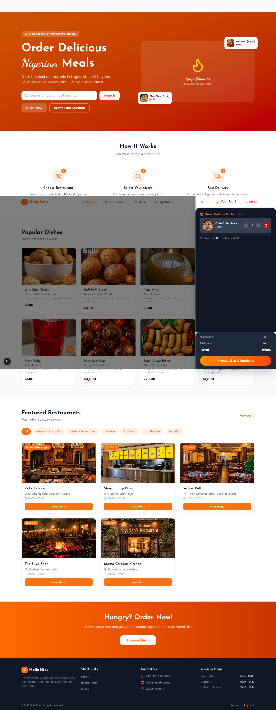
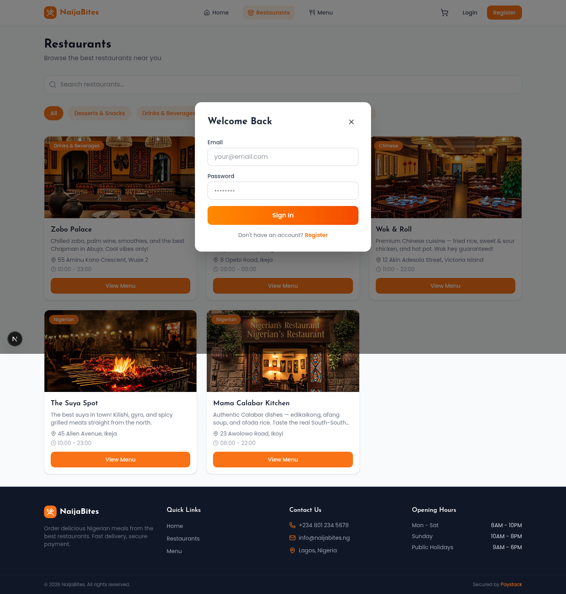
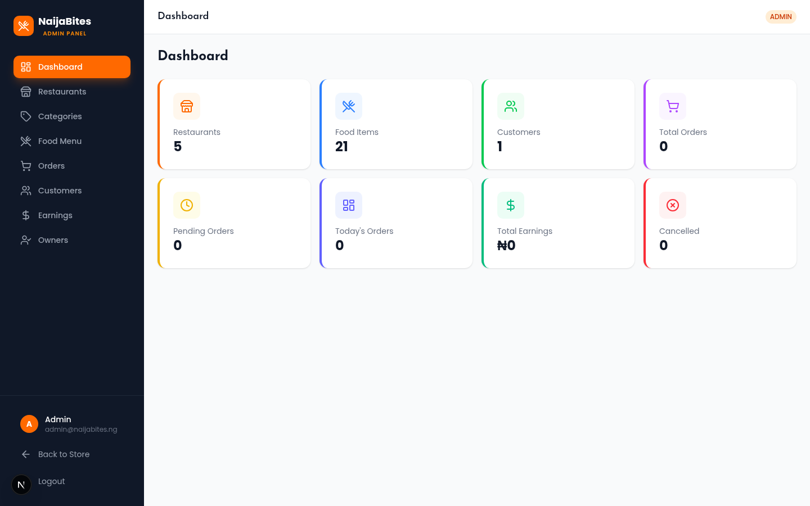
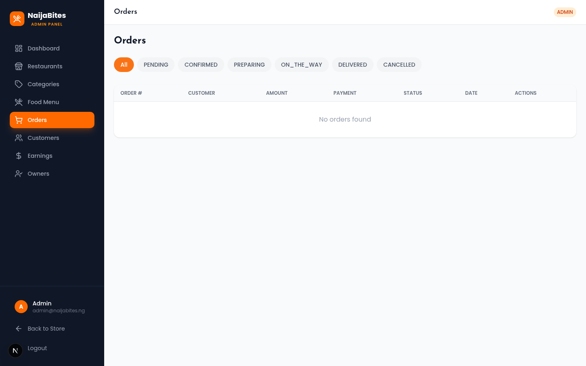
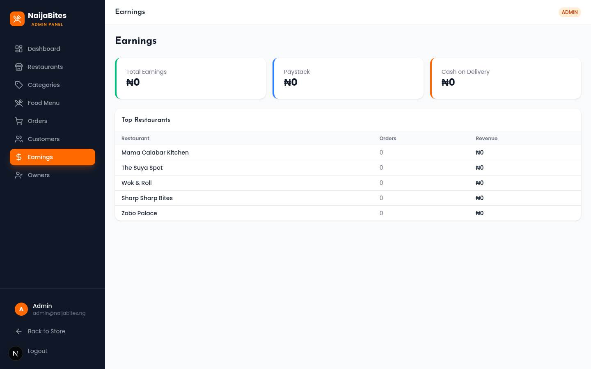
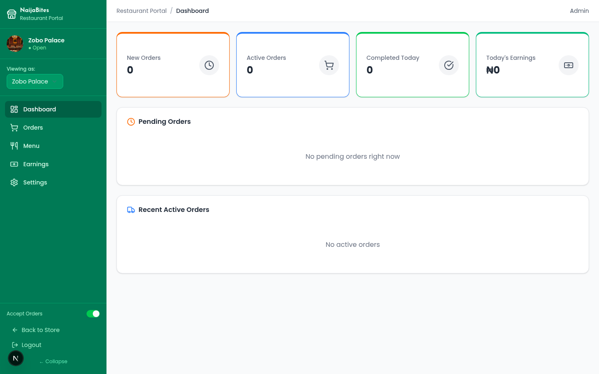
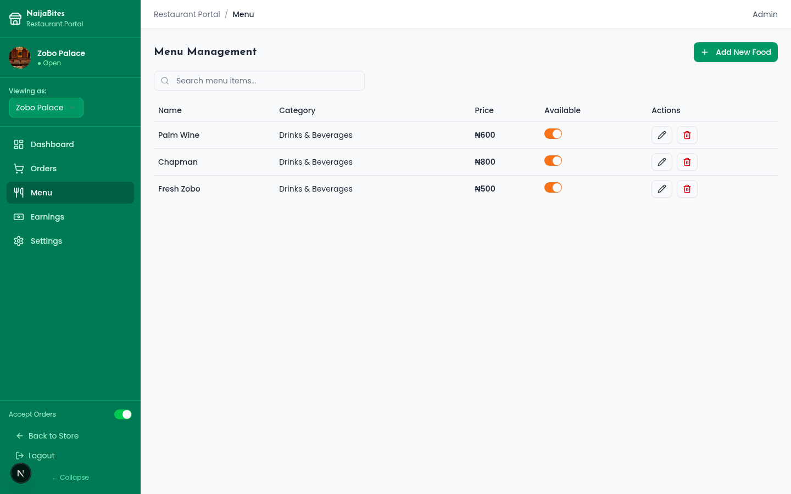

# 🍜 NaijaBites — Nigerian Food Ordering Platform

A full-stack Nigerian food ordering web application built with Next.js 16, featuring multi-restaurant ordering, Paystack payments, and dedicated dashboards for customers, restaurant owners, and admins.



---

## 📸 Screenshots

| Home Page | Menu Page |
|-----------|-----------|
|  |  |

| Restaurants | Cart & Checkout |
|-------------|-----------------|
|  |  |

| Login Modal | Admin Dashboard |
|-------------|-----------------|
|  |  |

| Admin Orders | Admin Earnings |
|-------------|----------------|
|  |  |

| Vendor Dashboard | Vendor Menu Management |
|------------------|------------------------|
|  |  |

---

## ✨ Features

### 🛒 Customer Portal (`/`)
- **Browse Menu** — Filter foods by category, search by name
- **Restaurant Listings** — Discover restaurants with ratings, city, and food count
- **Add to Cart** — Add items from multiple restaurants in one session
- **Multi-Restaurant Ordering** — Items from different restaurants are grouped into separate sub-orders, each with its own delivery fee and fulfillment timeline
- **Secure Checkout** — Delivery info with Nigerian states/cities dropdowns, auto-fill from profile
- **Paystack Integration** — Card, bank transfer, USSD payments with automatic verification
- **Cash on Delivery (COD)** — Alternative payment option
- **Order Tracking** — Real-time status updates per sub-order (PENDING → CONFIRMED → PREPARING → READY → ON_THE_WAY → DELIVERED)
- **User Profile** — Update name, phone, address, city, state
- **Authentication** — Register, login, session persistence via NextAuth.js JWT

### 🏪 Restaurant Owner / Vendor Portal (`/vendor`)
- **Dashboard** — Overview stats: today's orders, earnings, total menu items
- **Order Management** — Accept/reject incoming orders, update status through the fulfillment pipeline
- **Menu Management** — Add, edit, delete food items with Cloudinary image uploads
- **Settings** — Update restaurant info, bank details for payouts, toggle order acceptance
- **Earnings** — Revenue breakdown with platform commission tracking

### 🔧 Admin Portal (`/admin`)
- **Dashboard** — Platform-wide stats: restaurants, food items, orders, users, total earnings
- **Restaurant Management** — Add, edit, activate/deactivate restaurants, assign owners
- **Food Management** — Add, edit, delete any food item across all restaurants
- **Category Management** — Create and manage food categories
- **Order Management** — View all orders, update statuses, view details
- **Customer Management** — View all users, manage statuses
- **Owner Assignment** — Assign RESTAURANT_OWNER users to specific restaurants
- **Earnings Report** — Paystack vs COD breakdown, daily revenue chart, top restaurants by earnings

### 💳 Payment Flow (Paystack)
1. Customer selects **Paystack** at checkout
2. Order is created in the database with `paymentStatus: PENDING`
3. Backend calls Paystack `transaction/initialize` with `callback_url`
4. Customer is redirected to Paystack payment page (card/USSD/transfer)
5. On success, Paystack redirects to `/payment/callback?reference=...`
6. Callback page verifies payment via `/api/paystack/verify`
7. On confirmed success: order + sub-orders move to `CONFIRMED`, status history is recorded
8. Paystack webhook (`/api/paystack/webhook`) also handles `charge.success` and `charge.failed` events server-side

---

## 🏗️ Architecture

### Tech Stack
| Layer | Technology |
|-------|-----------|
| **Framework** | Next.js 16 (App Router, Turbopack) |
| **Language** | TypeScript 5 |
| **Styling** | Tailwind CSS 4 + shadcn/ui |
| **Database** | SQLite via Prisma ORM |
| **Authentication** | NextAuth.js v4 (Credentials, JWT strategy) |
| **State Management** | Zustand (cart, UI) + TanStack Query (server state) |
| **Payments** | Paystack (initialize → redirect → verify → webhook) |
| **Image Storage** | Cloudinary (via next-cloudinary) |
| **Animations** | Framer Motion |
| **Notifications** | react-hot-toast |
| **Icons** | Lucide React |

### Route Structure
```
src/app/
├── (customer)/          # Customer-facing pages
│   ├── page.tsx         # Home — hero, categories, popular dishes, restaurants
│   ├── menu/            # Full menu with filters
│   ├── restaurants/     # Restaurant listings
│   ├── orders/          # Order tracking
│   └── profile/         # User profile management
├── admin/               # Admin portal (auth-guarded)
│   ├── page.tsx         # Dashboard
│   ├── restaurants/     # Restaurant CRUD
│   ├── foods/           # Food CRUD
│   ├── categories/      # Category CRUD
│   ├── orders/          # Order management
│   ├── customers/       # User management
│   ├── earnings/        # Earnings report
│   └── owners/          # Owner assignment
├── vendor/              # Vendor portal (auth-guarded)
│   ├── page.tsx         # Dashboard
│   ├── orders/          # Order management
│   ├── menu/            # Menu management
│   ├── earnings/        # Earnings report
│   └── settings/        # Restaurant settings
├── payment/
│   └── callback/        # Paystack payment result page
└── api/
    ├── auth/            # NextAuth endpoints
    ├── categories/      # Category CRUD
    ├── foods/           # Food CRUD
    ├── restaurants/     # Restaurant CRUD
    ├── orders/          # Order creation & management
    ├── profile/         # User profile
    ├── users/           # User management
    ├── upload/          # Cloudinary image upload
    ├── dashboard/       # Dashboard stats & earnings
    └── paystack/        # Paystack integration
        ├── initialize/  # Start payment transaction
        ├── verify/      # Verify payment after redirect
        └── webhook/     # Handle Paystack events
```

### Database Schema
```
User ─┬─< Order ─< SubOrder ─┬─< OrderItem >─ Food
      │                      └─< SubOrderStatusHistory
      └─< Restaurant ─┬─< Food
                       └─< SubOrder
Order ─< OrderStatusHistory
Category ─┬─< Restaurant
          └─< Food
```

**Key Design Decisions:**
- **SubOrders** — When a customer orders from multiple restaurants, the parent `Order` splits into `SubOrder`s per restaurant (like Glovo/Chowdeck). Each restaurant only sees and manages their own sub-order.
- **Dual Payment Confirmation** — Payment is verified both on the callback page (client-initiated) and via Paystack webhooks (server-push), ensuring no payment is missed.
- **Commission Tracking** — Each `SubOrder` records `commissionRate`, `commissionAmount`, and `restaurantEarnings` for transparent revenue splitting.

---

## 🚀 Getting Started

### Prerequisites
- **Node.js** 18+ or **Bun** runtime
- **Git**

### 1. Clone & Install
```bash
git clone <your-repo-url>
cd online_food_ordering
bun install
```

### 2. Environment Setup
Copy the example env file and fill in your keys:
```bash
cp .env.example .env
```

Edit `.env` with your configuration:
```env
# Database (SQLite — zero config)
DATABASE_URL=file:./db/custom.db

# Auth — required for JWT sessions (change in production!)
NEXTAUTH_SECRET=your-secret-key-here

# App URL — used for Paystack callback redirect
NEXT_PUBLIC_APP_URL=http://localhost:3000

# Cloudinary (optional — for image uploads)
NEXT_PUBLIC_CLOUDINARY_CLOUD_NAME=your-cloud-name
CLOUDINARY_API_KEY=your-api-key
CLOUDINARY_API_SECRET=your-api-secret
CLOUDINARY_UPLOAD_FOLDER=naijabites

# Paystack (optional — for real payments, use test keys for development)
PAYSTACK_SECRET_KEY=sk_test_xxxxx
NEXT_PUBLIC_PAYSTACK_PUBLIC_KEY=pk_test_xxxxx
```

> **💡 Without Paystack keys**: The app uses a **mock payment flow** — you'll be redirected to a simulated payment success page. Perfect for development!
>
> **💡 Without Cloudinary keys**: Image uploads will fail silently. Add your Cloudinary credentials to enable restaurant/food image uploads.

### 3. Database Setup
```bash
# Push schema to SQLite database
bun run db:push

# Generate Prisma client
bun run db:generate

# Seed with sample data (admin user, categories, restaurants, foods)
bun run db:seed
```

### 4. Run the App
```bash
bun run dev
```

Open [http://localhost:3000](http://localhost:3000) in your browser.

### 5. Default Login Credentials

| Role | Email | Password |
|------|-------|----------|
| **Admin** | admin@naijabites.ng | admin123 |
| **Restaurant Owner** | (created via admin panel) | — |
| **Customer** | (register via UI) | — |

---

## 🧪 Testing Paystack Locally

For Paystack to redirect back to your local machine after payment, you need to expose your localhost:

1. **Using ngrok** (recommended):
   ```bash
   ngrok http 3000
   ```
   Then set `NEXT_PUBLIC_APP_URL` to your ngrok URL (e.g., `https://abc123.ngrok.io`)

2. **Using Paystack Test Mode**: Use Paystack test keys (`sk_test_...` / `pk_test_...`) and test cards from [Paystack's documentation](https://paystack.com/docs/testing/)

**Test Cards:**
| Card Number | Result |
|-------------|--------|
| 4084 0840 8408 4081 | Success |
| 4084 0000 0000 0002 | Failed |
| 5060 6666 6666 6666 666 | Success (Mastercard) |

---

## 📁 Project Structure

```
src/
├── app/                    # Next.js App Router pages & API routes
│   ├── (customer)/         # Customer pages (home, menu, restaurants, orders, profile)
│   ├── admin/              # Admin portal pages
│   ├── vendor/             # Vendor portal pages
│   ├── payment/callback/   # Paystack payment result page
│   └── api/                # Backend API routes
├── components/
│   ├── ui/                 # shadcn/ui base components
│   ├── home/               # Home page sections (Hero, Categories, PopularDishes, Restaurants)
│   ├── foods/              # Menu section component
│   ├── cart/               # Cart & checkout panel
│   ├── orders/             # Order tracking components
│   ├── auth/               # Login & Register forms
│   ├── admin/              # Admin sections (AdminSections, AdminLayout)
│   ├── restaurant-owner/   # Vendor sections (VendorSections, RestaurantOwnerLayout)
│   └── layout/             # Header, Footer
├── lib/
│   ├── db.ts               # Prisma client instance
│   ├── auth.ts             # NextAuth configuration
│   ├── auth-helpers.ts     # requireAuth, requireAdmin utilities
│   └── utils.ts            # formatNaira, getStatusColor, generateOrderNumber
├── stores/
│   ├── cart-store.ts       # Zustand cart store (items, groups, totals)
│   └── ui-store.ts         # Zustand UI store (login modal, cart panel)
├── hooks/
│   └── useAuth.ts          # Auth hook (isAuthenticated, user, session)
└── prisma/
    ├── schema.prisma       # Database schema
    └── seed.ts             # Sample data seeder
```

---

## 🔑 Key API Endpoints

| Method | Endpoint | Description |
|--------|----------|-------------|
| `POST` | `/api/auth/register` | Register new customer |
| `POST` | `/api/auth/[...nextauth]` | Login / session |
| `GET` | `/api/categories` | List categories with counts |
| `GET/POST` | `/api/foods` | List / create foods |
| `PUT/DELETE` | `/api/foods` | Update / delete food |
| `GET/POST` | `/api/restaurants` | List / create restaurants |
| `PUT` | `/api/restaurants` | Update restaurant |
| `POST` | `/api/orders` | Create order (with sub-order splitting) |
| `GET/PUT` | `/api/orders` | List / update orders |
| `GET` | `/api/profile` | Get user profile |
| `PUT` | `/api/profile` | Update user profile |
| `GET` | `/api/users` | List users (admin) |
| `POST` | `/api/upload` | Upload image to Cloudinary |
| `GET` | `/api/dashboard/stats` | Dashboard statistics |
| `GET` | `/api/dashboard/earnings` | Earnings data |
| `POST` | `/api/paystack/initialize` | Initialize Paystack payment |
| `GET` | `/api/paystack/verify` | Verify Paystack payment |
| `POST` | `/api/paystack/webhook` | Paystack webhook handler |

---

## 🛠️ Scripts

| Command | Description |
|---------|-------------|
| `bun run dev` | Start development server on port 3000 |
| `bun run lint` | Run ESLint |
| `bun run db:push` | Push Prisma schema to database |
| `bun run db:generate` | Generate Prisma client |
| `bun run db:migrate` | Run Prisma migrations |
| `bun run db:reset` | Reset database (⚠️ deletes all data) |
| `bun run db:seed` | Seed database with sample data |
| `bun run build` | Build for production |
| `bun run start` | Start production server |

---

## 🎨 Design Highlights

- **Nigerian-themed** orange color palette with warm accents
- **Responsive design** — Mobile-first with touch-friendly 44px+ targets
- **Animated transitions** — Cart slide-in, page transitions, status icon animations via Framer Motion
- **Smart cart** — Multi-restaurant grouping with per-restaurant delivery fees
- **Auto-fill checkout** — Delivery info pre-populated from user profile
- **Sticky footer** — Footer sticks to viewport bottom on short pages, pushed down on long pages
- **Accessible** — Semantic HTML, ARIA labels, keyboard navigation, sr-only content

---

## 📝 License

This project is for educational purposes. Built as a student project demonstrating full-stack web development with Next.js.

---

<div align="center">
  <p>Built with ❤️ and 🍜 by <strong>NaijaBites</strong></p>
  <p>Powered by Next.js 16 · Prisma · Paystack · Cloudinary</p>
</div>
